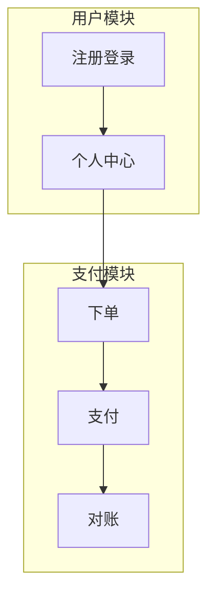
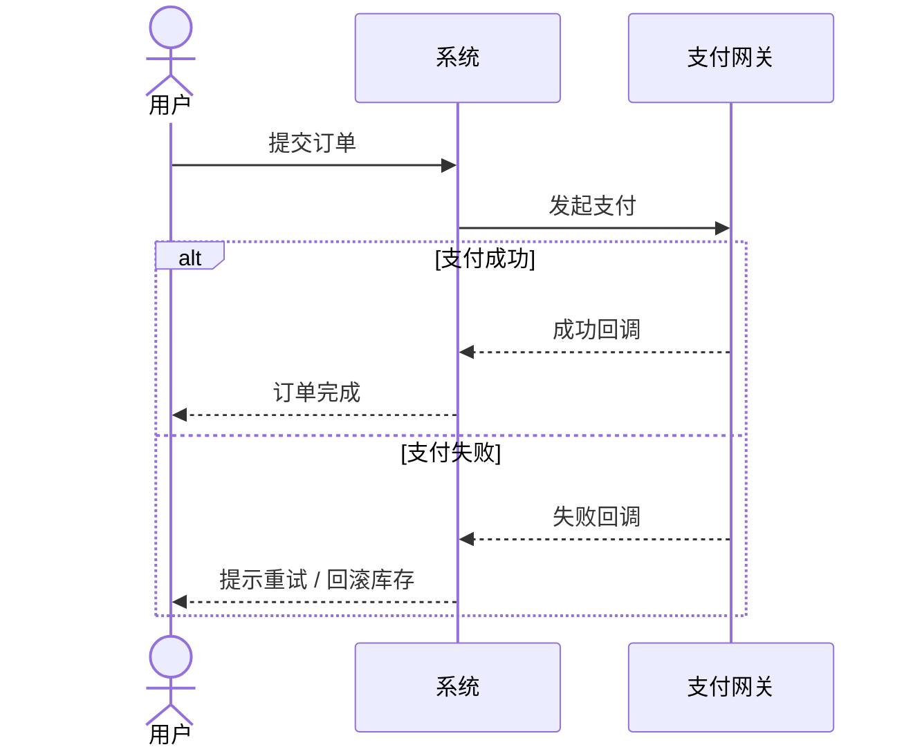
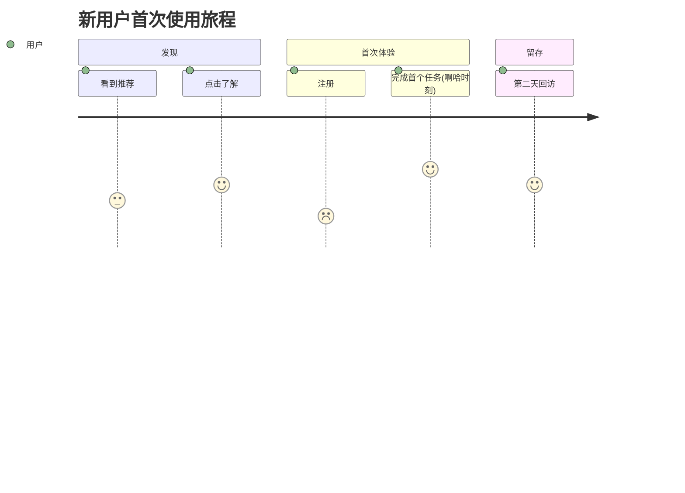

# Output Formats

Exact formats for the four living artifacts and the embedded visuals. The goal:
each artifact is specific, scannable, honest about what's solid vs. assumed, and
useful months later. Seed files live in `<skill-dir>/assets/`; this file is the
spec for filling and growing them.

General rules:
- **Specifics over platitudes.** Replace "提升用户体验" with a concrete, falsifiable
  statement. If a line could appear in any product's doc, it's not done.
- **Honesty markers.** Tag unvalidated claims inline as `[假设]` and cited facts
  with their source. The reader must always be able to tell knowledge from guess.
- **Living, not frozen.** Update in place across sessions. Keep `decision-log.md`
  append-only so history survives; the other three are revised freely.

---

## 1. `product-brief.md` — the master living document

The product seen whole. Organized by the eight layers so completeness is visible
in the structure itself. Keep each section tight; depth that doesn't fit goes to
a linked sub-doc. Skeleton:

```markdown
# [Product name] — Product Brief
_Last updated: YYYY-MM-DD · Mode: 0→1 | audit · Maintained by vibe-product-design_

## One-liner
[For [user] who [need], [product] is a [category] that [unique benefit], unlike [alternative].]

## 0 · Premise
- **Real problem:** …
- **Why now:** …
- **First-principles take:** …
- **Vision (5–10y):** …
- **Why us / unfair advantage:** …
- **Painkiller or vitamin:** …

## 1 · People
- **Target user:** …
- **Persona:** …
- **Beachhead (first 10–100):** …
- **Top pains (intensity × frequency):** …
- **Jobs To Be Done:** …

## 2 · Landscape
- **Market size:** … `[假设]` if not grounded; show the bottom-up logic.
- **Alternatives (incl. "do nothing"):** …
- **Competitors & the gap:** …
- **Trends / tailwinds:** …
- **Category (join vs. create):** …

## 3 · The Bet
- **Unique value proposition:** …
- **Strategy / how we win:** …
- **Focus — explicit non-goals:** We are deliberately NOT … · NOT … · NOT …
- **Moat / defensibility:** …
- **North Star metric:** …

## 4 · Experience
- **Solution concept:** …
- **Core flow:** [link to journey diagram]
- **Product principles:** 1) … 2) … 3) …
- **Information architecture:** …
- **Magic moment:** …
- **MVP definition:** …

## 5 · The Build
- **Functional architecture:** [link/diagram]
- **Feature list:** see `feature-list.md`
- **Roadmap:** MVP → next → later, each framed as a hypothesis it tests
- **Key process flows:** [links to swimlane diagrams]

## 6 · The Engine
- **Business model:** …
- **Pricing & logic:** …
- **Unit economics:** CAC ~… · LTV ~… · margin ~… `[假设]`
- **Distribution / GTM:** primary channel(s) + why + viability
- **Growth loop:** …
- **Key business metrics:** …

## 7 · The Risks
- **Riskiest assumptions (ranked):** 1) … 2) … 3) …
- **Validation plan (top assumptions):** experiment · metric · kill/continue threshold
- **Pre-mortem (most likely death):** …
- **Dependencies & constraints:** …
- **Second-order effects / ethics:** …
- **Open questions:** …
```

---

## 2. `coverage-map.md` — the no-gaps dashboard

The most important artifact: it makes "no omissions" mechanical and visible. One
row per dimension from `product-map.md`, with status, a one-line note, and (when
relevant) the next action. In **Mode B (audit)** this is your *first* deliverable.

Status legend: ✅ solid · 🟡 thin · ⚠️ assumption (unvalidated) · ❌ missing ·
🔴 contradiction.

```markdown
# Coverage Map — [Product name]
_Last updated: YYYY-MM-DD_

**Snapshot:** ✅ N · 🟡 N · ⚠️ N · ❌ N · 🔴 N  →  Foundation (L0–L3): [solid / exposed]

| # | Dimension | Status | Note / next action |
|---|---|---|---|
| 0.1 | Real problem | ✅ | Sharp, validated via 12 interviews |
| 0.2 | Why now | 🟡 | Plausible but not articulated — needs one crisp sentence |
| 0.3 | First principles | ❌ | Not yet examined |
| 0.4 | Vision | ✅ | — |
| 0.5 | Why us | ⚠️ | Claims domain expertise; unproven |
| 0.6 | Painkiller/vitamin | ✅ | Painkiller |
| 1.1 | Target user | 🔴 | Brief says "SMB owners"; pricing assumes enterprise — reconcile |
| … | … | … | … |
| 7.6 | Open questions | 🟡 | Listed but not prioritized |

## Priority gaps (work these next)
1. **0.3 First principles** (❌, foundational) — …
2. **1.1 ↔ 6.2 contradiction** (🔴) — target user vs. pricing tier …
3. **0.2 Why now** (🟡, foundational) — …
```

Maintain the snapshot line and the "priority gaps" list every time you update —
they're what the user scans first. Never let the map claim a layer is done when
rows are still ❌; honesty here is the whole point.

---

## 3. `feature-list.md` — the structured feature spec

Preserves a battle-tested four-level coding scheme. Use once features are firm
enough to spec (Layer 5); don't force it during early problem framing.

### Coding scheme

- **L1 — Module:** 2–3 uppercase letters for a top-level system module (e.g.
  `USR`, `PAY`). Unique; names the core capability.
- **L2 — Feature group:** two digits `01–99`. Related features grouped by
  business logic.
- **L3 — Feature point:** two digits `01–99`. A complete, independent unit of
  functionality.
- **L4 — Sub-feature:** two digits `01–99`. Smallest unit, written as a **user
  story**.

Full ID example: `PAY-02-03-01`.

### L4 user-story format

```
作为 [角色]
我想要 [功能]
以便于 [价值]
```

Each L4 must be specific, deliver user value, and be independently verifiable.

### Priority

- **P0 (must):** core value, foundational support, key user-value, stability.
- **P1 (should):** important features, experience lifts, ops efficiency,
  competitive parity.
- **P2 (could):** differentiation, polish, ops tooling, analytics.
- **P3 (later):** innovative/experimental, long-term, nice-to-have, customization.

Tie priority back to the bet: a P0 must serve the core problem (Layer 0) and the
strategy (Layer 3). If it doesn't, it isn't really P0 — challenge it.

### Effort

`XXS` 1–2 person-days · `XS` 3–5 pd · `S` 1–2 person-weeks · `M` 2–4 pw ·
`L` 1–2 months · `XL` 2–3 months · `XXL` 3+ months.

### Technical complexity

`Low` mature, routine · `Medium` some unknowns, needs investigation · `High` hard,
needs focused effort · `Very High` novel/risky, real chance of failure.

### Table format

```markdown
| ID | Title | 分级 | 优先级 | 描述 | 迭代规划 | 预估工作量 | 技术复杂度 |
|---|---|---|---|---|---|---|---|
| PAY-02-03-01 | 微信支付 | L4 | P0 | 作为付费用户，我想要用微信支付，以便于快速完成购买 | MVP | S | Medium |
```

Group rows under their L1/L2 headings so the hierarchy reads top-down.

---

## 4. `decision-log.md` — append-only decision record

Every real decision, why it was made, and what was rejected. The rejected
alternatives are often the most valuable part — they stop the team from
re-litigating settled questions and explain the product's shape to newcomers.

```markdown
# Decision Log — [Product name]

## YYYY-MM-DD · [Decision title]
- **Decision:** what we chose.
- **Context:** the question/tension that forced a choice.
- **Reasoning:** why this option won (tie to a layer or a thinking lens).
- **Rejected:** the alternatives and why each lost.
- **Revisit if:** the condition under which we should reopen this.
```

Log decisions, not status updates. "Chose usage-based pricing over seat-based"
belongs here; "wrote the pricing section" does not.

---

## 5. Visuals

Embed diagrams in the relevant doc. Prefer Mermaid (renders in most viewers,
diffs cleanly in git).

### Functional architecture — Mermaid flowchart / block



### Business process — Mermaid swimlane (via subgraphs or sequence)

Use a `sequenceDiagram` for role/system interactions; include the unhappy paths
(errors, rejection, rollback), not just the happy path.



### User journey — Mermaid journey



Annotate the journey with the **magic moment** (Layer 4.5) and the emotional low
points — those are the design priorities.

### Lean Canvas

When the business model takes shape, embed a one-screen Lean Canvas so the whole
model is visible at once. Nine blocks: Problem · Customer Segments · Unique Value
Proposition · Solution · Channels · Revenue Streams · Cost Structure · Key
Metrics · Unfair Advantage. A clean Markdown table or a 3×3 grid works; keep each
cell to a few sharp bullets, and mark any unvalidated cell with `[假设]`.

```markdown
| 问题 | 解决方案 | 独特价值主张 | 不公平优势 | 客户群体 |
|---|---|---|---|---|
| 关键指标 | | 渠道 | | |
| 成本结构 | | 收入来源 | | |
```

(Lean Canvas maps onto the product map: Problem→0.1, Segments→1.1, UVP→3.1,
Solution→4.1, Channels→6.5, Revenue→6.2, Cost→6.4, Key Metrics→3.5/6.7, Unfair
Advantage→0.5/3.4. Use it as a compact cross-check that the foundation holds
together, not as a replacement for the brief.)
